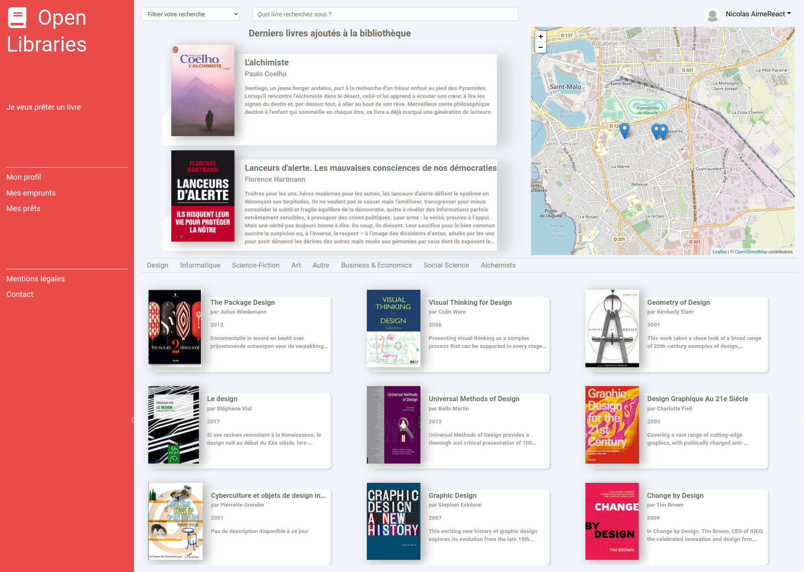

# :closed_book: Open-libraries :closed_book:

Page d'acceuil

Page d'un utilsateur connecté

:arrow_right:   Application de gestion d'emprûnt de livres (https://open-libraries.fr).

:arrow_right:   Projet sous Symfony 5.0 & React 16.12

Technos utilisées :

* Front-end : HTML/CSS, Sass, React JS, React-boostrap, React-router, Axios, Leaflet (pour la carte).
* Back-end : Symfony PHP.
* Sécurisation des échanges entre le front et le back : LexikJWTAuthentificationBundle.
* Utilisation de 2 API : 
  * Google Books pour obtenir les infos d'un livre.
  * API adresse (https://geo.api.gouv.fr/adresse) pour aider un utilisateur lors de son inscription, à remplir la partie adresse.

